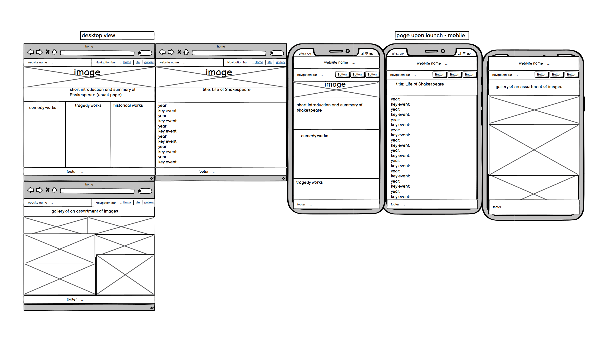
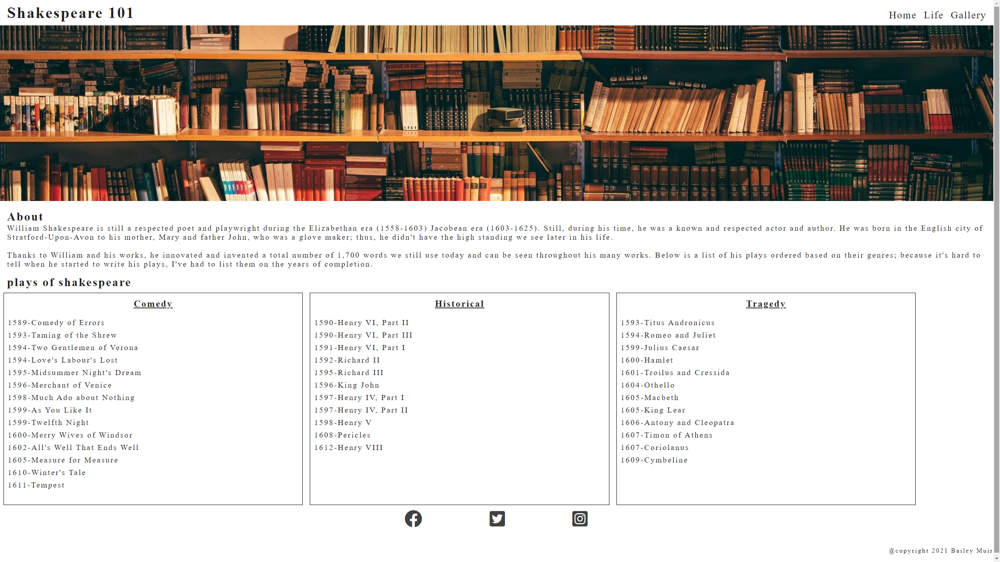
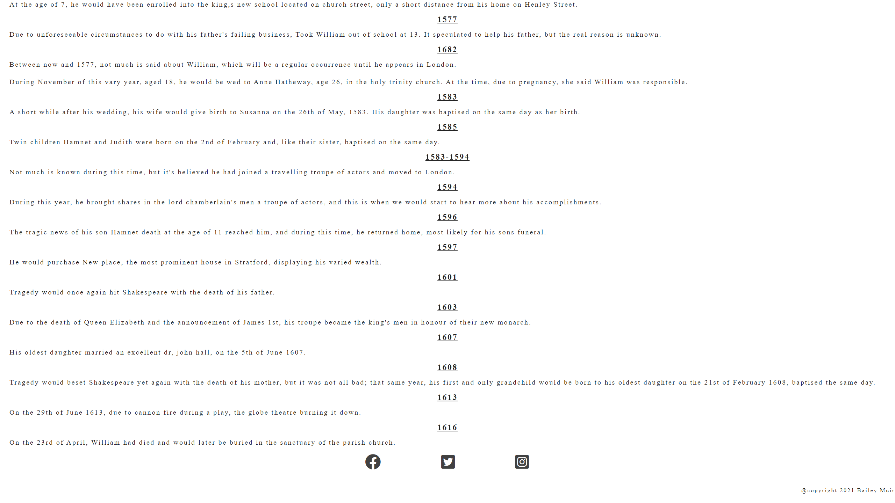

# Shakespeare 101

Shakespeare 101 is a site I designed to educate individuals on the life and works of William Shakespeare. My hope is it will help to inform people and provide itself as an efficient learning resource. It's designed to target students and individuals who are passionate about books and their writers. It will provide helpful information about his life and a list of all his plays/scripts.

# Features

## Header
The header contains a navigation bar for which there are three links each to a relevant page and a logo in the top right corner.

The navigation menu is designed to be responsive and easy for anyone to use; they clearly list the page they correspond to and allows the reader to get a brief description of what they are going to access.

Because of this, it will provide a smooth and relaxing experience for my target audience.

The logo is not responsive but acts as a visually appealing placeholder and a way to summarise what this website is about, so I decided on Shakespeare 101.

## Main image

Includes a landscape image to act as a visual cue to the target audience and act as a visually appealing section to catch their attention and acts as a nice contrast to what else is an information-rich environment.

It's designed to be reactive, so on smaller screens, the image won't appear pixilated as a result, it makes the viewer think that time and energy went into providing this information and will hopefully encourage them to explore and learn and reuse it in the future
about section.

Here we have a brief overview of William Shakespeare and gives them a glimpse of what the website is supposed to be an informational resource to enrich their learning and hopefully encourage them to continue looking through the page.

## Scrips section

Here we have a reactive element that will vary how many columns of information are available and how they are displayed based on their screen size.

It is a clear and concise way to separate his scrips based on their genre and order them from oldest to newest when they are completed.

## Footer

### Social media links

Each one provides a simple click away style link to one of three social media platforms.

Designed to react to the size of the screen that views it so it will always look like it's in place; this shows the user care when into the crafting of it.

### Copyright

There is a copyright section at the bottom of the footer; this is more for me as the web developer as it shows them who made it.

## Life of section

This is available after you use the life option on the clickable menu and quickly shows a correlation with the title life of William Shakespeare.

Here information on his life and key events are ordered in the year, and a summary of the event using h3 and p elements and like the rest, has style rules to help make it responsive to the changing of screen sizes to provide a seamless transition throughout the site and focuses on readability.

## Gallery section

Here images related to William Shakespeare are listed in columns such as his wife's childhood home; this page gives a nice break to the other word-heavy pages. As such should help keep them engaged, and just like the other images, they all have a description for accessibility.

The images are made to be responsive on a smaller screen; they display as a singular Columb, but on a larger screen, they will show two. This style rule is to keep the images clear to the viewer and make them think the website is high quality.

## Other features

The aria-label and labelledby elements are used to help with accessibility. This will make it more likely to appear on a search and make it useful to a wider audience, helping my goal as an owner educate as many people as possible.

The use of fontawesome to provide a visually appealing font for the reader to enjoy and a backup sans-serif if the browser doesn't allow its use.

# Future improvements.

A complete list of his poems and other works, not just plays
a sign-up page to join our reading club, where we look through all of his works and comment on our thoughts once a month.

# Testing

- I used google chromes developer tools to see how it would display in other viewports.
- I also used my phone and a tablet to see how it works on them directly.
- I tested it on chrome, Microsoft edge and firefox to see how it would work on popular browsers.
- I also used the w3c site to check the HTML and CSS as I went through my development process.

#UX

## Business goals

The goal is for the website to provide a free to use educational resource for everyone. It gives people an overview of William as a person through the many ups and downs of his life and a section to his life's works, his plays which still entertain readers and watchers today.
I also added aria-labelledby because I want it to be accessible to everyone as knowledge should be shared and shouldn't be limited to a single set of people.

## Users goals

### New users

- An easy way to obtain information in and around Shakespeare covering a wide array of information.
- An easy to use and follow layout to provide an effective learning environment for me as a user.
- An interactive environment allows studying no matter where I am, be it using a phone or laptop.

### Repeat users
- accurate and updated information.
- a learning resource that will continue to entertain and engage me as many times as I use it.

# User stories

### Owner
- To provide a learning platform for new and repeat users.
- To provide a visually appealing platform for others to use.
- I want my site to be accessible to everyone in the future.
- To provide only relevant and helpful information to my audience.
- A consistent high standard experience for all our users.

### New customer
- A way to find information relating to William Shakespeare all in one place.
- An easy way to navigate it all and access it whenever it is needed.
- An easy to follow layout so I can optimise my learning.

### Returning users
- A clear and concise way to find whatever I may need quickly and efficiently.
- I want an easy way to access a social platform to talk and engage with others who enjoy the works of or just the study of William Shakespeare.

# Website structure
First, I used Wireframe to provide a basic template of my website. This was to put across my ideas to make an efficient and visually appealing layout for my users and provide a hassle-free environment for them to learn in, such as the navigation bar.

# Wireframe design

# Bugs/Fixes

One error I found and fixed with the help of w3c HTML checker I had an h3 element in a ul for my then comedy, tragedy, etc. section tables. The fix was performed by removing them and placing them outside the ul.

Later due to the same lists mentioned above, I fixed it by changing a list item for a mixture of h3 and p elements and styling it to take 32% of the screen to maintain the structure of the index.html/home page.

One warning I cannot fix was the one to do with the Googlefont link because the validator its self couldn't check it; after searching, I found that this was just a fault on their end and nothing to worry about. the message it provided was "Imported style sheets are not checked in direct input and file upload modes".

Using w3c HTML validator, I found a warning as not every section had a header element. This was easy to fix by adding an h6 element to each one and styling it not to display and have a font-size of 0.

To fix the issue with the font-type selector, I had to add "" or ''around them to get them to work. I found the solution while changing it in the chrome dev tools.

The last bug I fixed for reactive display was the image constantly shrinking and becoming pixilated; to fix this, I used object-fit: cover;.

# Validator used
https://jigsaw.w3.org/css-validator/
https://validator.w3.org/

# Deployment procedure

### Deployment
The project is deployed on GitHub Pages, and I used Gitpod to develop my assignment. When I committed all changes, I used git add . followed by git commit -m "" providing a description or summary of the changes. I used git push to save changes to GitHub.

### To deploy a project, I had to:

Log in to GitHub and click on the repository I wanted to deploy in this case, my milestone one project, then we select the settings option above the style gallery and scroll till you reach the section listed as Github pages. Click on the source options box with the caption none and select the main branch and save. After this, refresh the page to get the link. It may take some time to create the webpage, but it will notify you when it is ready.

In my case, the link was posted on Github pages as https://baileymuir.github.io/milestone-project-1-html-and-css/ in my case, after going back, it stated that the Pages settings now has a dedicated tab! Check it out here! Upon clicking, it will provide you with the link address.

### Host locally

Log in to GitHub and click on the repository to download the file. Click the code button next to the green Gitpod button and press download ZIP; this will download all files in this repository and is easier than using the link it provides you to download.

# Credits

### template

The template comes from https://github.com/Code-Institute-Org/gitpod-full-template provided in the using our template section of the course.

### Code

I used the basic layout learned in the Boilerplate section of the love running walkthrough program.

I used what was taught in the header structure video from the love running section for the header and footer https://learn.codeinstitute.net/courses/course-v1:CodeInstitute+LR101+2021_T1/courseware/4a07c57382724cfda5834497317f24d5/637be1a2e3b84b25aa33f3ab4d98603c/?child=first%20and%20Footer%20Main%20Structure%20https://learn.codeinstitute.net/courses/course-v1:CodeInstitute+LR101+2021_T1/courseware/4a07c57382724cfda5834497317f24d5/e6d4cda2bc08458ba94d2092be9bad3a/?child= and https://learn.codeinstitute.net/courses/course-v1:CodeInstitute+LR101+2021_T1/courseware/4a07c57382724cfda5834497317f24d5/e6d4cda2bc08458ba94d2092be9bad3a/?child=first to help with the HTML.

https://stackoverflow.com/questions/1733006/how-to-set-an-images-width-and-height-without-stretching-it provided me with the information to stop the image blurring by using object-fit: cover;.

all Fontawesome code came directly from https://fontawesome.com/

https://www.w3schools.com/css/css3_multiple_columns.asp was helpful when trying to fix the issue with my original script list before scrapping it but was useful later to help style my gallery page.

## Content

### For the content, I used two sources

https://www.youtube.com/watch?v=qafnuBH8KPs and https://www.opensourceshakespeare.org/views/plays/plays_alpha.php for the list of plays.

https://www.freecodecamp.org/news/css-media-queries-breakpoints-media-types-standard-resolutions-and-more/ for media query information.

## Images
Unsplash.com provided all images.
https://unsplash.com/photos/L2sbcLBJwOc - bust of Shakespeare
https://unsplash.com/photos/cHSUganOkiE - Globe theatre
https://unsplash.com/photos/2FkV-4CiDY4 - Anne Hathaway's cottage
https://unsplash.com/photos/uuKE4DnGcfY - mural of Shakespeare
https://unsplash.com/photos/uzZGI9XwKyE - a collection of Three plays
https://unsplash.com/photos/YLSwjSy7stw - bookshelf

# Readme.md
https://github.com/marcin-kli/MP1/blob/Milestone-Projects/README.md used to help structure the Readme file; it was provided by my mentor Adegbenga Adeye.

# Resources used

- HTML and CSS - to structure and style the pages, respectively.
- Fontawesome - for icons used in footer.
- Googlefonts - provided me with the fonts needed to style my page.
- GitHub-was used as a way to store and deploy my assignment.
- Gitpod - allowed me to develop my assignment.
- Developer tools chrome - allowed me to make small changes to work without affecting Gitpod, and check how it would look on specific devices based on their viewport size.
- Balsamiq wireframe - was used to make the basic design as a template.

# Finished project - screenshots

